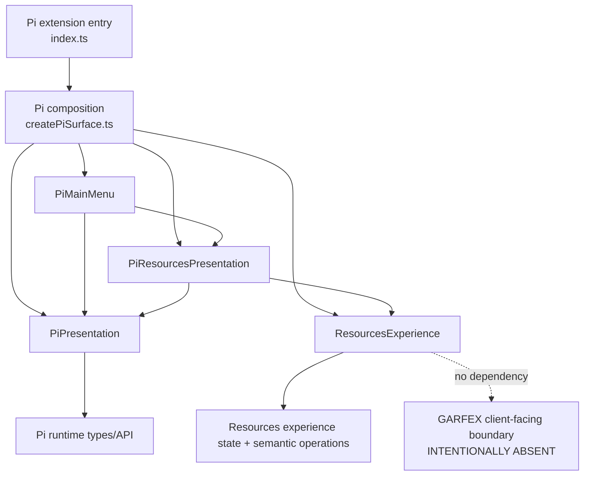

# Materialized GARFEX Surface architecture

This document describes **only what exists in this repository now**. [ADR 0001](decisions/0001-garfex-surface-foundation.md) defines the Surface foundation; [ADR 0002](decisions/0002-independent-external-client-boundary.md) defines its independent external client boundary. Accepted direction must not be mistaken for implemented integration.

## Current implementation

| Area | Materialized responsibility |
| --- | --- |
| `surface/features/resources/` | Host-neutral Resources interaction intent, state, search draft, and projection. It preserves search input without assigning business meaning and exposes an explicit `client-contract-not-materialized` status with no business data. |
| `hosts/pi/PiPresentation.ts` | Concrete wrapper over the current Pi command context. It is Pi-specific, not a universal host abstraction. |
| `hosts/pi/PiResourcesPresentation.ts` | Spanish Resources rendering/input and physical return behavior. Invokes the headless Resources experience. |
| `hosts/pi/PiMainMenu.ts` | Spanish Pi main menu and physical host navigation. |
| `composition/createPiSurface.ts` | Constructs the concrete feature and Pi presentation objects; contains no behavior. |
| `index.ts` | Registers the Pi `/garfex` command and starts the composed Pi Surface. |
| `tooling/architecture/check.mjs` | Standalone Node standard-library guard for repository independence and headless dependency direction. It does not select product tooling. |

The headless feature preserves the search draft exactly as entered and records search and browse as separate explicit intents. It does not trim, normalize, accept, reject, or assign business meaning to empty search input while the real GARFEX client-facing contract is absent.

## Implemented dependency diagram



Solid arrows are current source dependencies. The dotted line marks a deliberate absence, not an adapter, mock, repository, SDK, transport, or fake capability.

## Accepted direction versus implemented pieces

The accepted direction permits future host presentations to depend on headless features and future features to consume narrow capability views derived only from an explicitly public, external, versioned, client-safe GARFEX contract. None of the following is implemented here: a GARFEX client contract, Resource DTOs, transport, authentication/login, Remote State cache, Web host, forms framework, agentic route, or Temporal integration.

The Surface is an untrusted external client. Backend module `public.ts`, Convex bindings, schemas, generated code, private packages, and `@garfex/*` packages are not client contracts and are not importable. Shared contractual meaning does not imply shared implementation. UI-owned adapters may eventually implement public semantics, but no adapter, artifact, SDK, or transport is selected now.

The narrow checker is materialized and scans only this repository (or an explicitly supplied fixture root):

```text
node tooling/architecture/check.mjs
node --test tooling/tests/architecture.test.mjs
```

It rejects backend/source/package/workspace/Git linkage and headless-to-host imports. The default scan excludes controlled violation fixtures and ignored/generated directories. It does not inspect a sibling repository and does not select the product package/build/typecheck/test/lint/format/CI baseline.

Backend-owned policy remains canonical in the `garfex-platform` repository. Its stable counterpart for this boundary is the **“Independent external client boundary” decision (Accepted 2026-08-24)**; no sibling filesystem checkout is assumed.
