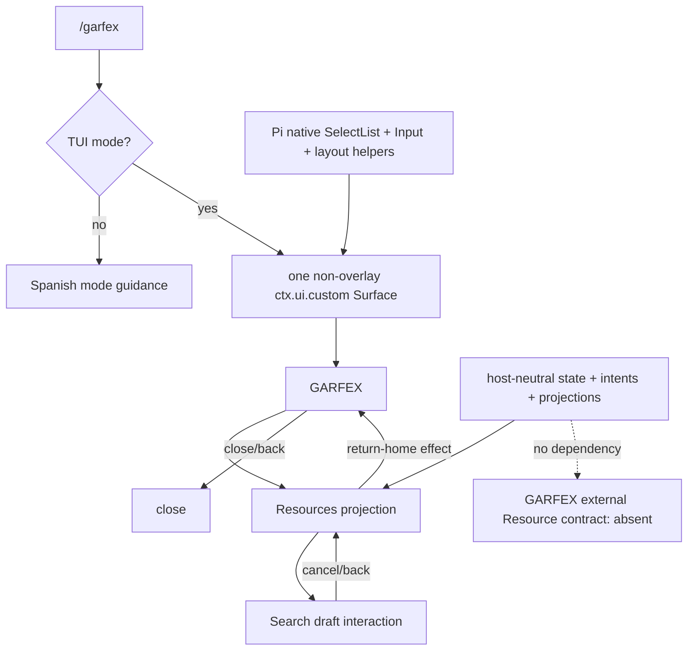

# Materialized GARFEX Surface architecture

The implementation is a Pi-native Surface with reusable Resources interaction state. [ADR 0003](decisions/0003-pi-ui-kit-v1.md) owns the UI convention; ADRs [0001](decisions/0001-garfex-surface-foundation.md) and [0002](decisions/0002-independent-external-client-boundary.md) remain authoritative for the Surface and external boundary.

## Review map

| Area | Responsibility |
| --- | --- |
| `surface/features/resources/` | Exact draft, Resources/Search location, semantic intents, projection, and return-home effect. No Pi dependency or business data. |
| `hosts/pi/PiPresentation.ts` | One `ctx.ui.custom` component composed from native Pi TUI components; focus, keyboard, width safety, and physical navigation. |
| `hosts/pi/PiResourcesPresentation.ts` | Selective Resources projection-to-Spanish-view mapping. |
| `hosts/pi/PiMainMenu.ts` | Honest GARFEX choices for the Pi host. |
| `composition/createPiSurface.ts` | Pi component construction at the composition edge. |
| `index.ts` | `/garfex`, TUI gating, and the single safe recovery boundary. |
| `tooling/architecture/check.mjs` | Repository independence plus Surface/host and anti-framework boundaries. |

## State and flow



Cancellation changes navigation only. It is not execution, failure, or clearing. The retained single-line Input writes the exact draft and preserves its cursor for the Surface lifetime; empty and whitespace drafts are preserved without interpretation. Search execution is absent and the view says so.

## Dependency rules

Allowed direction:

```text
Pi entry/composition → Pi presentation → reusable feature
```

Reusable `surface/` code cannot import Pi packages or `hosts/`. The checker also rejects generic UI-port/component-framework structures, frontend domain/application/repository layers, and fake backend-shaped DTO/client/repository artifacts. Rules are path- and structure-oriented rather than global vocabulary bans.

The independent client boundary remains unchanged: no backend source, schemas, generated bindings, private packages, sibling workspace, Git dependency, invented contract, or fake Resource response.

## Minimal baseline

`package.json` and `package-lock.json` pin the two actual Pi 0.84.2 packages and require Node `>=22.19`. Node strips erasable TypeScript syntax and runs the tests directly. No compiler, linter, formatter, bundler, build pipeline, or CI policy is implied.

```text
npm test
npm run check:architecture
```
