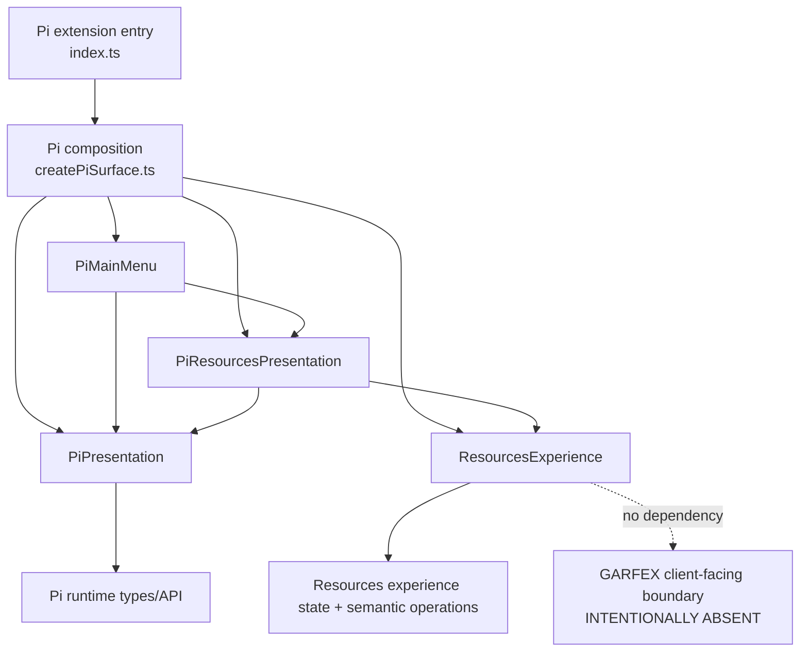

# Materialized GARFEX Surface architecture

This document describes **only what exists in this repository now**. The broader accepted direction is recorded in [ADR 0001](decisions/0001-garfex-surface-foundation.md); accepted direction must not be mistaken for implemented integration.

## Current implementation

| Area | Materialized responsibility |
| --- | --- |
| `surface/features/resources/` | Host-neutral Resources interaction intent, state, search draft, and projection. It preserves search input without assigning business meaning and exposes an explicit `client-contract-not-materialized` status with no business data. |
| `hosts/pi/PiPresentation.ts` | Concrete wrapper over the current Pi command context. It is Pi-specific, not a universal host abstraction. |
| `hosts/pi/PiResourcesPresentation.ts` | Spanish Resources rendering/input and physical return behavior. Invokes the headless Resources experience. |
| `hosts/pi/PiMainMenu.ts` | Spanish Pi main menu and physical host navigation. |
| `composition/createPiSurface.ts` | Constructs the concrete feature and Pi presentation objects; contains no behavior. |
| `index.ts` | Registers the Pi `/garfex` command and starts the composed Pi Surface. |

The headless feature preserves the search draft exactly as entered and records search and browse as separate explicit intents. It does not trim, normalize, accept, reject, or assign business meaning to empty search input while the real GARFEX client-facing contract is absent.

## Implemented dependency diagram

Solid arrows are current source dependencies. The dotted line marks a deliberate absence, not an adapter, mock, repository, SDK, transport, or fake capability.

## Accepted direction versus implemented pieces

The accepted direction permits future host presentations to depend on headless features and future features to consume narrow capability views derived from real GARFEX client-facing contracts. None of the following is implemented here: a GARFEX client contract, Resource DTOs, transport, authentication/login, Remote State cache, Web host, forms framework, agentic route, Temporal integration, or architecture enforcement tooling.

Backend-owned constraints remain canonical in the sibling backend documentation:

- [Surface/UI and Harness boundary](../../garfex-platform/docs/surface-ui-harness-boundary.md)
- [Authentication and authorization boundary](../../garfex-platform/docs/auth-boundary.md)
